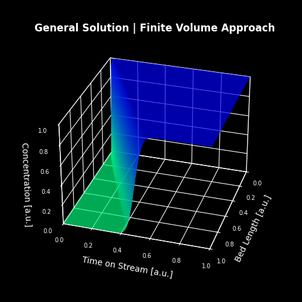
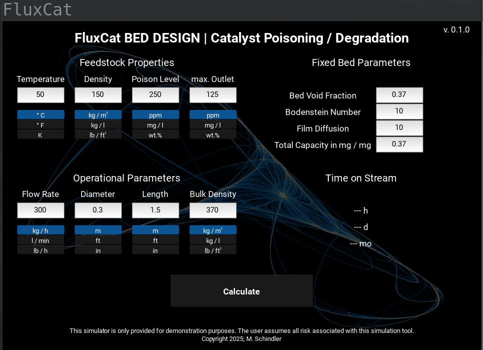

# FluxCat: High-Fidelity Numerical Solver for Non-Linear Transport Phenomena

[](https://choosealicense.com/licenses/mit-license/)
[](https://www.python.org/)

**FluxCat** is a high-performance computational framework designed to simulate transient, multi-dimensional transport phenomena in porous media. At its core, it implements a robust **Finite Volume Method (FVM)** to solve non-linear Advection-Diffusion-Reaction equations.

While the primary application is the prediction of catalyst degradation in fixed-bed reactors, the underlying engine is a generalized numerical solver capable of simulating any system governed by similar partial differential equations (PDEs).

**The primary goal of this project is to generate high-fidelity, physically consistent synthetic datasets to serve as "Ground Truth" for training fast-inference Machine Learning surrogate models.**



**Figure 1:** Plotted solution for a breakthrough curve pattern of a packed bed.


## Technical Highlights

### 1. Numerical Core & Stability
The solver handles the challenges of high-gradient solutions and numerical oscillations through several advanced techniques:
*   **Finite Volume Discretization:** Ensures local and global mass conservation.
*   **High-Resolution Flux Limiters:** To prevent the Gibbs phenomenon (numerical oscillations) and ensure monotonicity, the solver implements multiple flux-limiter schemes:
    *   `UMIST` (Optimized for steep gradients)
    *   `van Leer`
    *   `Superbee`
    *   `Monotonized Central`
    *   `Minmod`
*   **CFL Condition (Courant–Friedrichs–Lewy):** Dynamic time-stepping and spatial discretization are calculated based on the CFL condition to ensure numerical stability.
*   **Non-Linear Coupling:** The engine accounts for the non-linear interdependence between velocity fields and concentration gradients.

In the crypto space, high correlation is often mistaken for causation. **CausCrypto** addresses this by implementing a multi-stage statistical pipeline:

### 2. Software Architecture
FluxCat is engineered with a clear **separation of concerns**, following a decoupled Model-View architecture:

*   **Computational Backend (`FVSorption.py`):** A pure-python numerical engine optimized with `NumPy` for vectorized array operations. It handles the PDE discretization, time-integration, and boundary condition management.
*   **Presentation Layer (`FluxCat.py`):** A professional GUI developed with the `Kivy` framework, allowing users to interact with the complex mathematical model without accessing the source code.
*   **Data Normalization Layer:** A robust unit-conversion system that maps heterogeneous industrial inputs (Imperial/Metric) into a standardized SI-base for the solver, ensuring data integrity.



**Figure 2**: Graphical User Interface.

---

## Tech Stack
*   **Language:** Python 3.x
*   **Numerical Computing:** NumPy
*   **Frontend/GUI:** Kivy
*   **Mathematics:** Finite Volume Method (FVM), PDE Solver

---

## Connection to Machine Learning (The AI Pipeline)
In industrial settings, running high-fidelity simulations is computationally expensive and time-consuming. FluxCat serves as the **Data Engine** in a larger ML pipeline:

1.  **Synthetic Data Generation:** FluxCat generates thousands of precise simulation runs across a wide parameter space.
2.  **Surrogate Training:** These datasets are used to train Neural Networks (PyTorch/TensorFlow) or Gradient Boosting models (XGBoost).
3.  **Fast Inference:** The resulting ML surrogate replaces the expensive PDE solver, reducing inference time from seconds/minutes to milliseconds while maintaining $> 99 %$ accuracy.

---

## Installation & Usage

```bash
# Clone the repository
git clone https://github.com/markus-schindler/FluxCat.git
cd FluxCat

# Create a virtual environment (optional but recommended)
python -m venv /path/to/new/virtual/environment
source /path/to/new/virtual/environment/bin/activate

# Install dependencies
pip install -r requirements.txt

# Run the application
python FluxCat.py
```

## Project Structure
```text
├── FluxCat.py          # GUI
├── FVSorption.py       # Main execution engine
├── content.kv          # Kivy layout file
├── README.md           # This file
├── requirements.txt    # Dependency list
└── LICENSE             # MIT License
```

## License
This project is licensed under the MIT License.

© 2026 Markus Schindler
